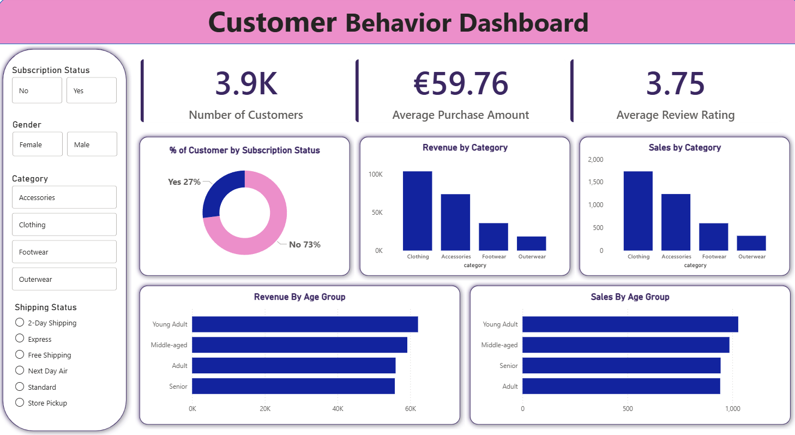

# Customer Shopping Behavior Analysis - Capstone Project

An end-to-end data analysis project combining Python, SQL, and Power BI to analyse customer shopping behavior across 3,900 transactions.

---

## Tools Used

- Python (pandas, SQLAlchemy)
- PostgreSQL
- Power BI
- Jupyter Notebook

---

## Dataset

`customer_shopping_behavior.csv` — 3,900 rows, 18 columns covering customer demographics, purchase details, and shopping behavior. 37 missing values in the Review Rating column.

---

## What I Did

**Python — Data Cleaning & Feature Engineering**

- Explored the dataset using pandas (shape, dtypes, nulls, summary stats)
- Imputed 37 missing Review Ratings using per-category median
- Renamed all columns to snake_case, removed special characters
- Created an `age_group` column by binning ages into 4 groups
- Created a `purchase_frequency_days` column by mapping frequency labels to numeric intervals
- Dropped `promo_code_used` after confirming it was identical to `discount_applied`
- Exported the cleaned dataset to PostgreSQL using SQLAlchemy

**SQL — Business Analysis (PostgreSQL)**

Answered 10 business questions:

| # | Question | Key Finding | SQL Concept |
|---|---------|------------|-------------|
| Q1 | Revenue by Gender | Male: $157,890 / Female: $75,191 | `GROUP BY`, `SUM` |
| Q2 | High-spending discount users | 839 customers spent above average with discounts | Subquery, `AVG` |
| Q3 | Top 5 products by rating | Gloves (3.86), Sandals (3.84), Boots (3.82) | `ROUND`, `AVG`, `ORDER BY` |
| Q4 | Shipping type comparison | Express ($60.48) vs Standard ($58.46) | `WHERE IN`, `AVG` |
| Q5 | Subscribers vs Non-subscribers | 1,053 subscribers / 2,847 non-subscribers | `COUNT`, `SUM`, `GROUP BY` |
| Q6 | Discount-dependent products | Hat (50%), Sneakers (49.66%), Coat (49.07%) | `CASE WHEN`, percentage calculation |
| Q7 | Customer segmentation | Loyal: 3,116 / Returning: 701 / New: 83 | `CTE`, `CASE WHEN` |
| Q8 | Top 3 products per category | Jewelry, Blouse, Sandals, Jacket lead each category | `CTE`, `ROW_NUMBER()` |
| Q9 | Repeat buyers & subscriptions | 2,518 repeat buyers not subscribed vs 958 subscribed | `WHERE`, `GROUP BY` |
| Q10 | Revenue by age group | Young Adult: $62,143 / Middle-aged: $59,197 | `GROUP BY`, `SUM`, `ORDER BY` |

**Power BI — Dashboard**

Built an interactive dashboard with 3 KPIs (3.9K customers, $59.76 avg purchase, 3.75 avg rating) and visuals for subscription status, revenue by category, and revenue by age group. Slicers for subscription, gender, category, and shipping type.

---

## Key Findings

- Male customers generate 2x more revenue than female customers
- 73% of customers are not subscribed — large untapped retention opportunity
- Hat and Sneakers have ~50% discount rate — worth reviewing impact on margins
- Young Adults drive the highest revenue at $62,143
- Express shipping users spend slightly more on average

---

## How to Run

1. Install: `pip install pandas sqlalchemy psycopg2-binary`
2. Run `customer_behavior_analysis.ipynb` in Jupyter — update PostgreSQL credentials before the export cell
3. Load the SQL file in pgAdmin and run queries against the exported table
4. Open `Customer_Behavior_Dashboard.pbix` in Power BI Desktop

> Do not commit PostgreSQL credentials to GitHub.

---

## Dashboard Preview

